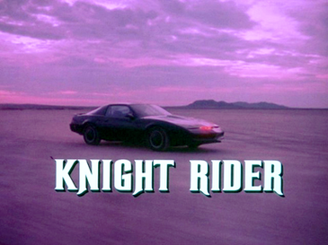
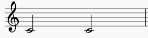

# Tone.js Starter

Starter code to get up and running making music with Tone.js

[Tone.js](https://github.com/Tonejs/Tone.js/) is an amazing JavaScript library which makes working with the Web Audio API much easier! 

## Running the code locally

- Download or clone this repo
- Install dependencies `npm install`
- Run gulp tasks `gulp`, `gulp-sass`, & `gulp-scripts`

---

## About

**This repo is intended to help others who are interested in making music with JavaScript.**
The code provided is utilizing an excellent library called Tone.js

Tone.js makes working with the Web Audio API much easier as it takes care of a lot of tedious tasks for you. If you've ever worked with the Web Audio API you may have some strong opinions but one thing you are likely to agree with is that it's a bit tricky to do anything meaningful, other than having a couple of oscillators generate a tone. Tone.js has a ton of features but rather than me explaining all of them you can check out:  [tone.js examples](https://tonejs.github.io/examples/) and here are a few things people have made:  [Demos](https://tonejs.github.io/demos)

**What this repo contains** is a demo project which recreates the theme to the 80's TV show **Knight Rider** 



Yes the man the legend David Hasselhoff stared in this 80's TV show before baywatch and if you don't know the theme song you may have heard it sampled by artists like Busta Rhymes e.g. the song: ["Turn It Up (Remix) / Fire It Up"](https://youtu.be/YmHziduwBgI?t=1m5s)
Many others have also sampled this icon TV theme, maybe you recognize [some of these songs](https://www.whosampled.com/Stu-Phillips/Theme-From-Knight-Rider/sampled/).

But this projects purpose isn't about the history of sampled TV themes, it's about create music with JavaScript, so let's take a look at a few examples before jumping into the project code.

**Link to Tone.js [CDN](https://cdnjs.cloudflare.com/ajax/libs/tone/13.0.1/Tone.min.js)**

---

## Examples

I recommend starting out by trying some of the examples in CodePen. 
**Important! Turn your device volume down before opening the links.**

### Creating a kick sound
``` javascript
// create a new synth and route the output to master
const synth = new Tone.MembraneSynth().toMaster();
// play a note with the synth we setup
synth.triggerAttackRelease("C2", "8n");
```

Membrane Synth Example [codepen](https://codepen.io/Onomicon/pen/MqOGEO?editors=1010)

*Note that if you didn't hear the kick sound in the codepen example turn your volume up slightly and refresh the page, the sound only plays once and on page load.*

---

### Looping the kick sound

We are going to get into creating a sequence in a few minutes however to create a simple repeating pattern you can use the Tone.Loop function.
Tone.Loop takes two parameters which are `( callback , interval ) `.

The callback is the function to run each time the loop repeats and in our example this is where we play a note using `synth.triggerAttackRelease`.

The interval is the unit of time for the loop to repeat at. In this example the time is set to half notes using `2n`.

Half note notation example: 




``` javascript
// create a new synth
const synth = new Tone.MembraneSynth().toMaster();

var loop = new Tone.Loop(function(time) {
  // Run once per eighth note, 8n, & log the time
  console.log(time);
  // trigger synth note
  synth.triggerAttackRelease("C2", "8n");
}, "8n").start(0);

// Start the transport which is the main timeline
Tone.Transport.start();
```

Membrane Synth Loop [codepen](https://codepen.io/Onomicon/pen/rZYvdK)

*No need to refresh the page here as we now have a loop that will continue to play*

---

### Creating a sequence with an array of notes

You can create a sequence with Tone.Sequence and pass an array of note values to be played.

Creating a new Sequence has the following options: Callback, events, and subdivision e.g.
Tone.Sequence ( callback , events , subdivision )

The callback is the function that runs for every note, Events are the notes in the sequence and subdivision is the overall timing of playback e.g. 4n = quarter notes. You can find more info about timing of playback and their values here: [Timing options](https://github.com/Tonejs/Tone.js/wiki/Time)

Quarter notes are represented with `4n`


Eighth notes are represented with `8n`


Sixteenth notes are represented with `16n`


``` javascript
// create a synth
const synth = new Tone.MembraneSynth().toMaster();
// create an array of notes to be played
const notes = ["C3", "Eb3", "G3", "Bb3"];

// create a new sequence with the synth and notes
const synthPart = new Tone.Sequence(
  function(time, note) {
    synth.triggerAttackRelease(note, "10hz", time);
  },
  notes,
  "4n"
);

// Setup the synth to be ready to play on beat 1
synthPart.start();
// Note that if you pass a time into the start method you can specify when the synth part starts e.g. .start('8n') will start after 1 eighth note

// start the transport which controls the main timeline
Tone.Transport.start();
```

Synth Sequence [codepen](https://codepen.io/Onomicon/pen/dqZKbP?editors=0010)

---

In the examples above the screenshots of notation are only showing rhythms with a fixed note of C. However if you've noticed that in the examples we have other notes and numbers after e.g. `C3`. The letters and numbers represent the note value e.g. `C` and the octave of the note, the overall pitch. If you've ever heard the term 'middle C' that is represented with `C4`, and it's called middle C due to it being roughly in the middle of the piano.


[Designation by octaves](https://en.wikipedia.org/wiki/C_(musical_note)#Designation_by_octave)

---
### Adding rests

So you may have noticed how the notes we have in our sequence all play one after the other which is ok but what about if you need to have a break between notes. If we revisit our example above, specifically the notes, we can add a value of 'null' to indexes in our array to create a rest e.g.

``` javascript
const notes = ["C3", "Eb3", null, "G3", "Bb3"];
```

Notice that we also now have a 5 beat repeating pattern, pretty cool if you don't mind me saying so!

Synth Sequence 2 [codepen](https://codepen.io/Onomicon/pen/MPYwXx)

If we wanted to create the iconic note pattern to the mission impossible theme we could try

``` javascript
const notes = ["G2", null, "G2", "Bb2", "C3"];
```

Mission implausible [codepen](https://codepen.io/Onomicon/pen/gBbpBX)

``` javascript
const notes = ["G2", [null, "G2"], null, "Bb2", "C3"];
```

Mission improbable [codepen](https://codepen.io/Onomicon/pen/dgPoqO)

``` javascript
const notes = [
    "G2",
    [null, "G2"],
    null,
    "Bb2",
    "C3",
    "G2",
    [null, "G2"],
    null,
    "F2",
    "F#2"
  ];
```

Mission Impossible :) [codepen](https://codepen.io/Onomicon/pen/aRzOPv)


## Additional Resources
- [Tone.js Presets](http://tonejs.github.io/Presets/) 
- [Tone.js Sequence](https://tonejs.github.io/docs/r12/Sequence)
- [Piano Key Frequencies](https://en.wikipedia.org/wiki/Piano_key_frequencies)